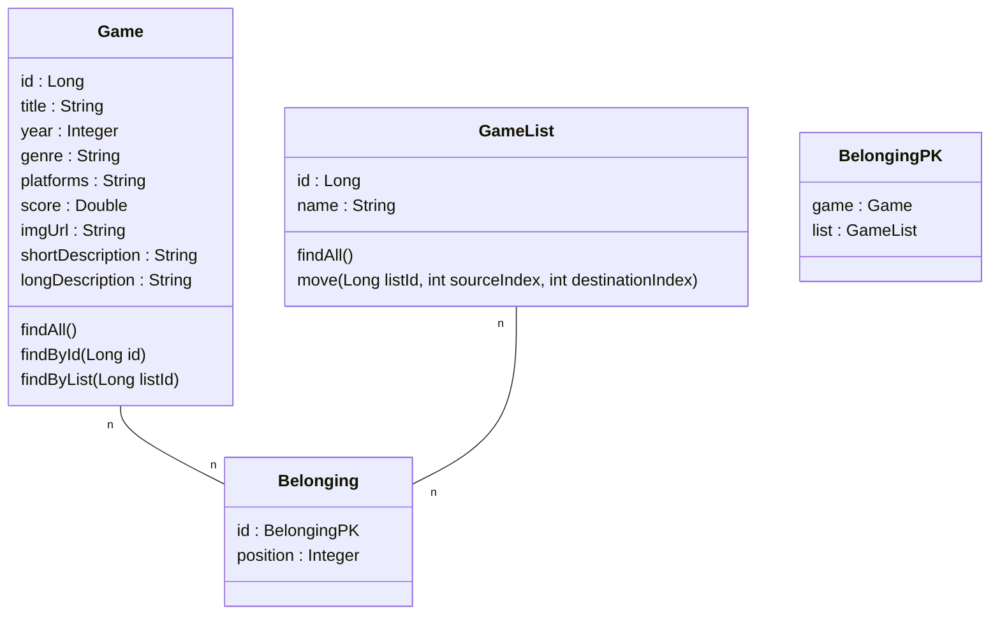

# 🎮 **Arsenal Game**

O **Arsenal Game** é uma aplicação back-end desenvolvida em **Java** utilizando o framework **Spring Boot** durante a 1ª edição de 2025 da **Semana DevSuperior**. O projeto consiste em uma **API REST** para gerenciar coleções de jogos dos gêneros **RPG** e **Plataforma**, com foco em permitir que os usuários visualizem e reordenem suas listas de jogos de forma personalizada.

---

## 🚀 **Objetivo do Projeto**

O projeto tem como objetivo principal consolidar conceitos e práticas essenciais para o desenvolvimento web com **Java** e **Spring Boot**. Durante o desenvolvimento, foram abordados tópicos como arquitetura em camadas, mapeamento objeto-relacional (ORM), consultas SQL no Spring Data JPA, padrões REST e deploy em produção.

---

## 🛠 **Conceitos e Tecnologias Aplicados**

✅ **Java**: Linguagem principal para o desenvolvimento da aplicação.  
✅ **Spring Boot**: Framework para criar uma API robusta e escalável.  
✅ **Maven**: Ferramenta de gerenciamento de dependências e automação do build.  
✅ **Arquitetura em camadas**: Organização do código em **Controller**, **Service** e **Repository**.  
✅ **Cliente/Servidor, HTTP e JSON**: Comunicação entre front-end e back-end usando padrões REST.  
✅ **Entidades e ORM com JPA/Hibernate**: Modelagem de dados e mapeamento objeto-relacional.  
✅ **Padrão DTO**: Encapsulamento e transferência de dados entre camadas da aplicação.  
✅ **Relacionamentos N-N**: Implementação de associações entre entidades no banco de dados.  
✅ **Consultas SQL personalizadas**: Utilização do **Spring Data JPA** para realizar queries otimizadas.  
✅ **Database Seeding**: Automação para popular o banco de dados com dados iniciais para testes.  
✅ **H2 Database**: Banco de dados em memória para ambiente de desenvolvimento.  
✅ **PostgreSQL**: Banco de dados utilizado para deploy em produção.  
✅ **CI/CD com Railway**: Deploy contínuo em um ambiente de produção na nuvem.  

---

## 📊 Diagrama de Classes:



## 🗄️Estrutura do Projeto

O projeto é composto por três principais recursos, que são conjuntos de classes e interfaces responsáveis por mapear tipos de objetos e gerenciar sua persistência em um banco de dados relacional. Além disso, há uma classe auxiliar utilizada para a definição de chaves primárias compostas.

### Recursos e Classe Auxiliar

| Classe        | Descrição |
|--------------|----------------------------------------------------------------------------------------------------------------------------------------|
| Game         | Representa um jogo dentro da coleção, sendo responsável pelo mapeamento e armazenamento da entidade no banco de dados. |
| GameList     | Define a estrutura de uma coleção de jogos, permitindo a organização e gerenciamento das listas criadas. |
| Belonging    | Atua como uma entidade associativa entre Game e GameList, indicando a posição de cada jogo dentro de uma determinada lista. |
| BelongingPK  | Classe auxiliar utilizada para definir uma chave primária composta, combinando os atributos game_id e list_id. |


Cada um dos recursos citados acima gera uma tabela correspondente no banco de dados, com exceção da classe auxiliar BelongingPK, que é utilizada exclusivamente para a composição da chave primária.


## 📋 **Funcionalidades**

Atualmente, o sistema suporta apenas as seguintes funcionalidades:

- 📌 **Listar jogos**: Obtenha todos os jogos cadastrados na base.  
- 🔄 **Reordenar lista**: Personalize a ordem dos jogos na coleção.  

### ✅ **Ações Futuras**

No futuro, planejamos implementar as seguintes funcionalidades:

- ➕ **Adicionar jogos**: Cadastre novos jogos na coleção.
- ✏️ **Editar jogos**: Atualize informações de jogos existentes.  
- ❌ **Excluir jogos**: Remova jogos da coleção.  

---

## 🗄️ **Camadas**

O projeto segue o padrão de camadas:  
- **Controller**: Gerencia as requisições HTTP e retorna as respostas.  
- **Service**: Contém a lógica de negócios.  
- **Repository**: Responsável pela interação com o banco de dados via JPA.  

---

## 🛠 **Como Executar o Projeto**

**Pré-requisitos**: Java 17

1️⃣ **Clone o repositório**:
```bash
git clone https://github.com/deizirrs/dslist.git
```

2️⃣ **Acesse o diretório do projeto**:
```bash
cd dslist
```

3️⃣ **Configure o ambiente (se necessário)**:
- Ajuste o arquivo `application.properties` para configurar o banco de dados.

4️⃣ **Execute o projeto**:
```bash
mvn spring-boot:run
```

5️⃣ **Acesse a API**:
- **Localhost**: [http://localhost:8080](http://localhost:8080)

---
## Dependências utilizadas no projeto:

|   Dependência     |                              	Descrição                                    
|-------------------|----------------------------------------------------------------------------------------------------------------------------------------|
| Spring Web        | Essa dependência fornece todas as bibliotecas necessárias para criar um projeto WEB e trabalhar com o protocolo HTTP/HTTPS.            |
| Spring Data JPA   | Java Persistence API (JPA) é uma Biblioteca que armazena e recupera Objetos, que foram persistidos (armazenados) em um Bancos de Dados.|
| PostgreSQL Driver | Responsável pela conexão entre nossa aplicação e o Banco de Dados PostgreSQL                                                           |
| H2 Database       | Responsável pela conexão entre nossa aplicação e o Banco de Dados H2                                                                   |
---

## 📌 **Rotas Principais da API**

Atualmente, as rotas disponíveis são:

| Método | Endpoint                   | Descrição                                       |
|--------|----------------------------|------------------------------------------------|
| GET    | `/games`                   | Lista todos os jogos                           |
| GET    | `/lists`                   | Lista todas as listas                          |
| GET    | `/lists/{id}/games`        | Lista os jogos pertencentes a uma lista        |
| GET    | `/games/{id}`              | Detalha informações de um jogo específico      |

### ✅ **Ações Futuras**

No futuro, novas rotas serão adicionadas para suportar CRUD completo:

| Método | Endpoint                   | Descrição                                       |
|--------|----------------------------|------------------------------------------------|
| POST   | `/games`                   | Adiciona um novo jogo                          |
| PUT    | `/games/{id}`              | Atualiza informações de um jogo específico     |
| DELETE | `/games/{id}`              | Remove um jogo do sistema                      |

---

## 📦 **Deploy em Produção**

O deploy foi realizado utilizando a plataforma **Railway**, com o **PostgreSQL** como banco de dados para produção.  

🔗 [Arsenal Game](https://dslist-production-b882.up.railway.app)

---

## 👩‍💻 **Autora**

**Deiziane Rodrigues**  
🔗 [LinkedIn](https://www.linkedin.com/in/deizianer/)

